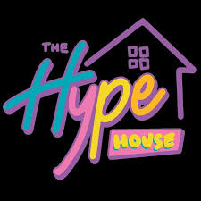

# HYPEHOUSE

### First Rough Draft:
- Vision: rent to influencers so they can use their “hype” to become more famous.HypeHouse is a platform for short-term rentals created specifically for influencers and content producers. By providing upscale "HypeHouses" with top-notch recording facilities and rentals, this platform guarantees an ideal stay for individuals seeking to expand their brand while taking advantage of first-class housing and go viral!

### Planning:
- For: content influencers / vloggers
- Who: Need a legitimate platform to rent reputable locations
- The: Hypehouse is a rental platform
- That: Provides our customers with the convenience of reputable locations and lodgings to record to stay at, but more importantly, the social aspect of being in the vicinity of other influencers.
- Unlike: AirBNB, who doesn’t focus on the social aspect.
HypeHouse differentiates itself from Airbnb by not only offering high-end short-term rentals but also fostering a social environment tailored for influencers and content creators. 

### FINAL Vision Statement:
**HypeHouse is more than just a rental platform, it’s a thriving community designed specifically for content influencers and vloggers. We provide a seamless way to access reputable, high-end locations and lodgings, ensuring creators have the perfect backdrop for their content. But beyond just a place to stay, HypeHouse fosters a unique social ecosystem where influencers can collaborate, network, and grow together. Unlike Airbnb, which focuses solely on accommodations, HypeHouse is built around the influencer lifestyle, offering an immersive environment that enhances creativity, visibility, and engagement.**

User requirements: User is a verified influencer, User is of legal responsibility
System requirements: Mobile phone application, website, 
Security and privacy options for high-profile influevers.

### Use Case: 
- ID: *create personal ID’s for users*
- Name: Renting HypeHouse
- Description: Influencer has a listing of houses for rent for social networking. Influencer then chooses there desired house to rent for x amount of days
- Primary actor: influencer
- Preconditions: verified influencer who has to have an account and logged into said account
- Postconditions: Influencer has access to property listings.
**Main Success Scenario:** 
1. Influencer registers for an account. Verifies with an ID and social media handle.
2. Once verified, influencer has access to every property and dates available for said listings.

### For NONFUNCTIONAL:
- Performance : Updating listing page and fetching listings should be < 50ms
- Availability: Downtime for our website should be no more than 5 seconds a year. 
- Scalability: Utilziing cloud to make the listings and profiles grow with our user base. 
- Usability: Easy to book a house (No bloat in terms of UI and streamlined work-flow).
- Security: Encrypted data of user profiles  

### For FUNCTIONAL: 
- Dashboard : Homepage for user (client/renter) to access our systems 
- Explore System : Listings of rentable houses. Able to view specifics and rent places, or communicate with renter. 
- Profile System: User/renter profiles to gauge attributes
- Communication System: Has inboxes and outboxes, contact pages, messaging system to communicate with clients 
- Booking & Reservation System : User authentication and verification via social media accounts.
- Security & Privacy Controls: Identity verification

